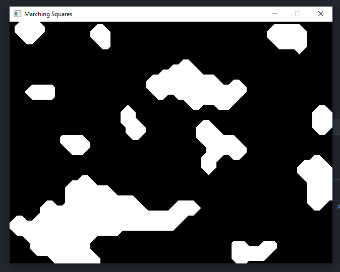

# Marching squares

Simple Marching Squares implementation in ebiten.
Based on Sebastian Lague's Marching Squares tutorial.



### Basic

This showcases the basic Marching Squares implementation.
There are nothing more than just an image.

```
go run ./cmd/1_basic/main.go
```

### Aggregate

This features a square that can be moved on the marching squares map.
To move the square, press and hold <kbd>Mouse 3</kbd> as if you are panning.
Aggregate in this context is adding a square with moving functionality on the marching squares map.

```
go run ./cmd/2_aggregate/main.go
```

### Product

This features the whole marching squares map to be dragged.
This also offers the same keyboard input as the Aggregate.
Product in this context means dragging functionality on the marching squares map itself.

```
go run ./cmd/3_product/main.go
```

## Limitations

- Drawing in Triangles.
- OpenGL vertex limit

## License

MIT